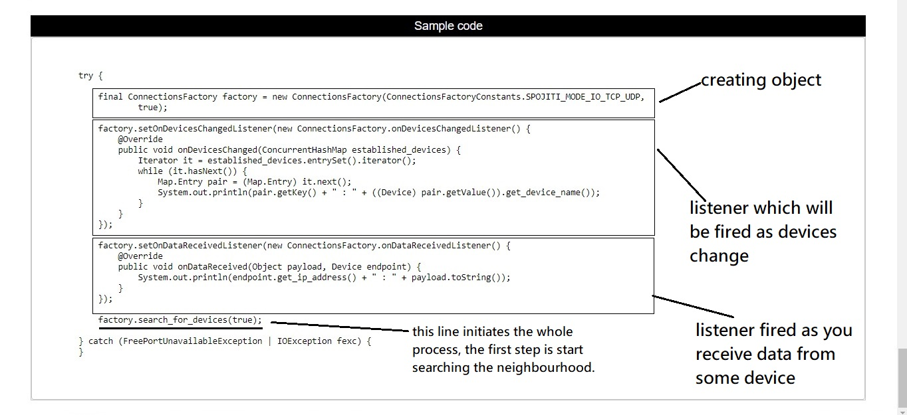
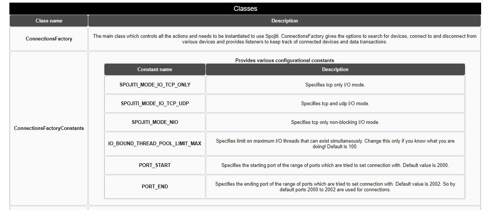
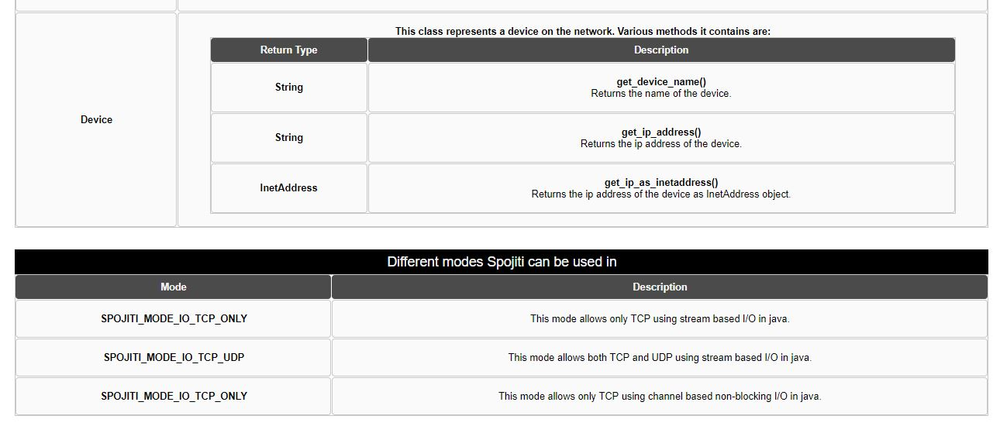
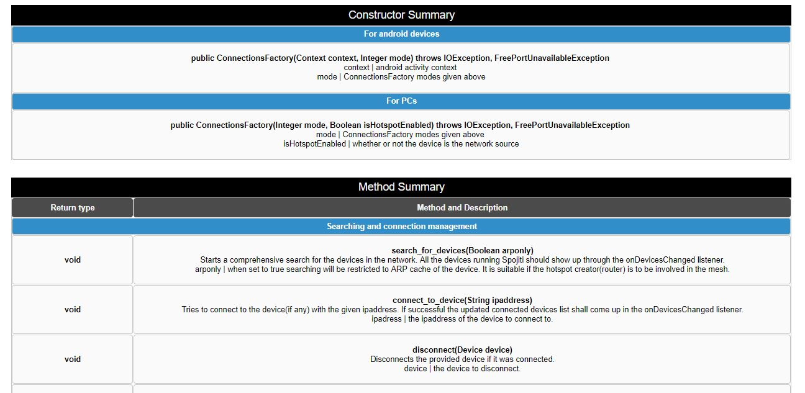
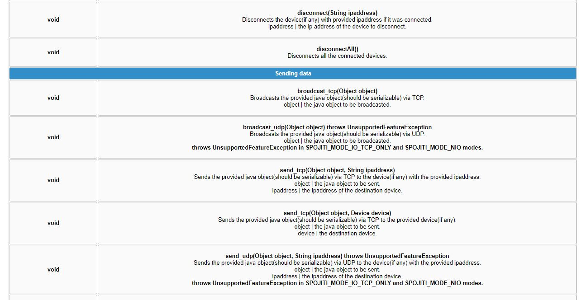
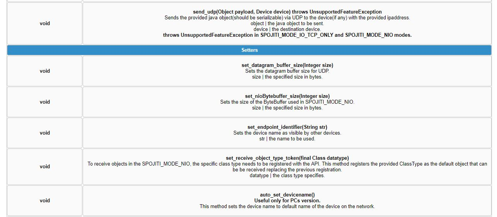
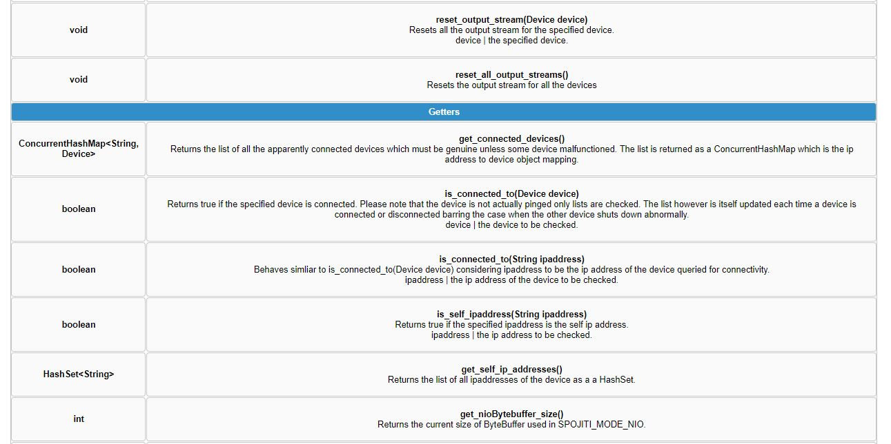
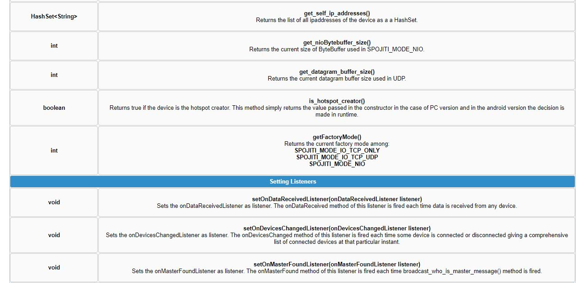
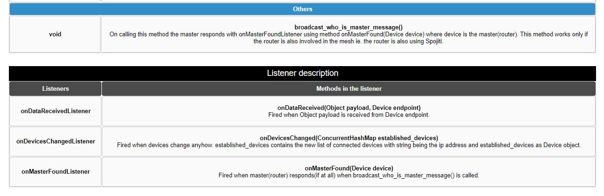

# spojiti
Spojiti is an Application Programming Interface written in java to create and manage socket connections among various devices on a local network. Spojiti can be used as a backbone to any multiplayer game or multi user app on a local network.

Images below describe the functions, constructors, constants and listeners used in the API:

